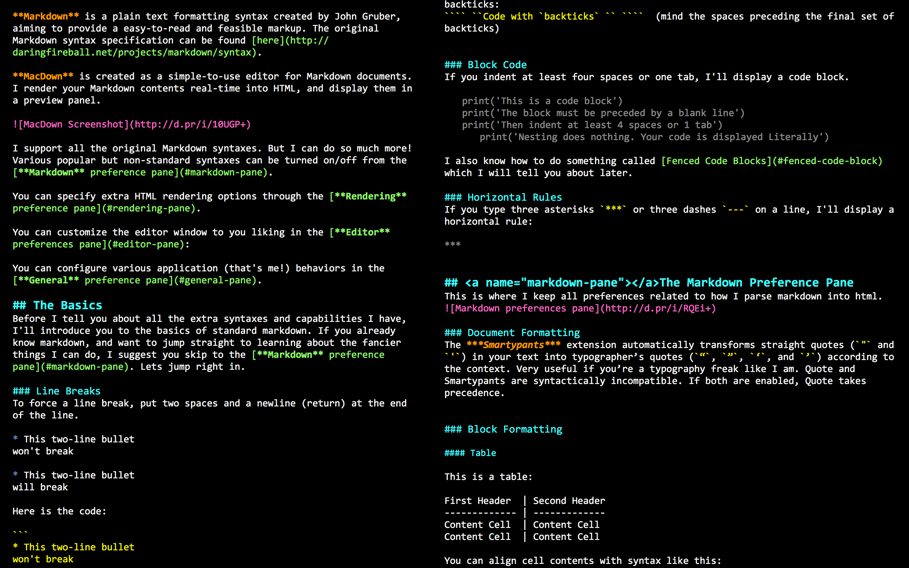

# Hytrast for MacDown: A High-contrast Color Scheme

## Features

* High contrast
* Completely black background
* Colorful and easy-to-read texts

## Install 

1. Download [`hytrast.style`]()
2. Move it to `~/Library/Application Support/MacDown/Themes/`
2. Open MacDown. Go to Preferences -> Editor -> Theme and select `hytrast`

## Demo

